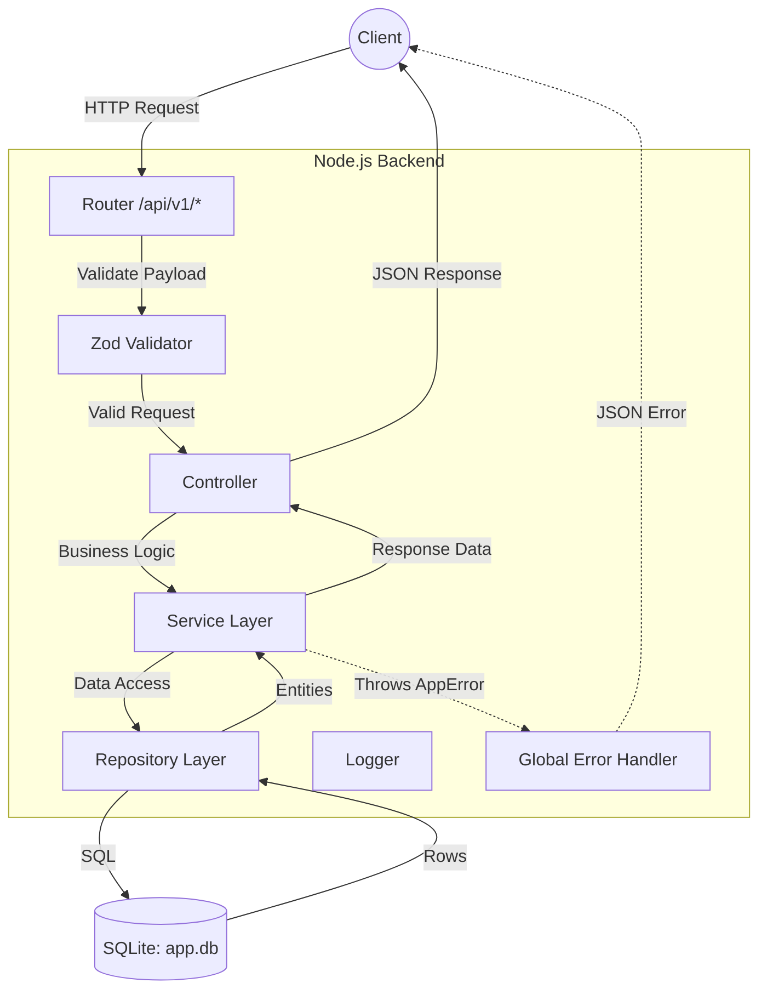

# Architecture

```mermaid
graph TD
    Client((Client))

    subgraph Node.js Backend
        Router[Router /api/v1/*]
        Controller[Controller]
        Service[Service Layer]
        Repository[Repository Layer]
        Validator[Zod Validator]
        Logger[Logger]
        ErrorHandler[Global Error Handler]
    end

    Database[(SQLite: app.db)]

    Client -->|HTTP Request| Router
    Router -->|Validate Payload| Validator
    Validator -->|Valid Request| Controller
    Controller -->|Business Logic| Service
    Service -->|Data Access| Repository
    Repository -->|SQL| Database
    Database -->|Rows| Repository
    Repository -->|Entities| Service
    Service -->|Response Data| Controller
    Controller -->|JSON Response| Client

    Service -.->|Throws AppError| ErrorHandler
    ErrorHandler -.->|JSON Error| Client
```
