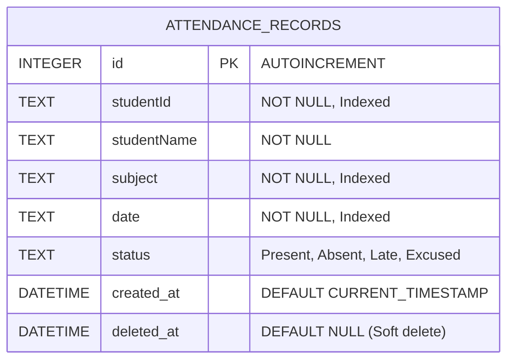

# Entity Relationship Diagram

```mermaid
erDiagram
    ATTENDANCE_RECORDS {
        INTEGER id PK "AUTOINCREMENT"
        TEXT studentId "NOT NULL, Indexed"
        TEXT studentName "NOT NULL"
        TEXT subject "NOT NULL, Indexed"
        TEXT date "NOT NULL, Indexed"
        TEXT status "Present, Absent, Late, Excused"
        DATETIME created_at "DEFAULT CURRENT_TIMESTAMP"
        DATETIME deleted_at "DEFAULT NULL (Soft delete)"
    }
```
