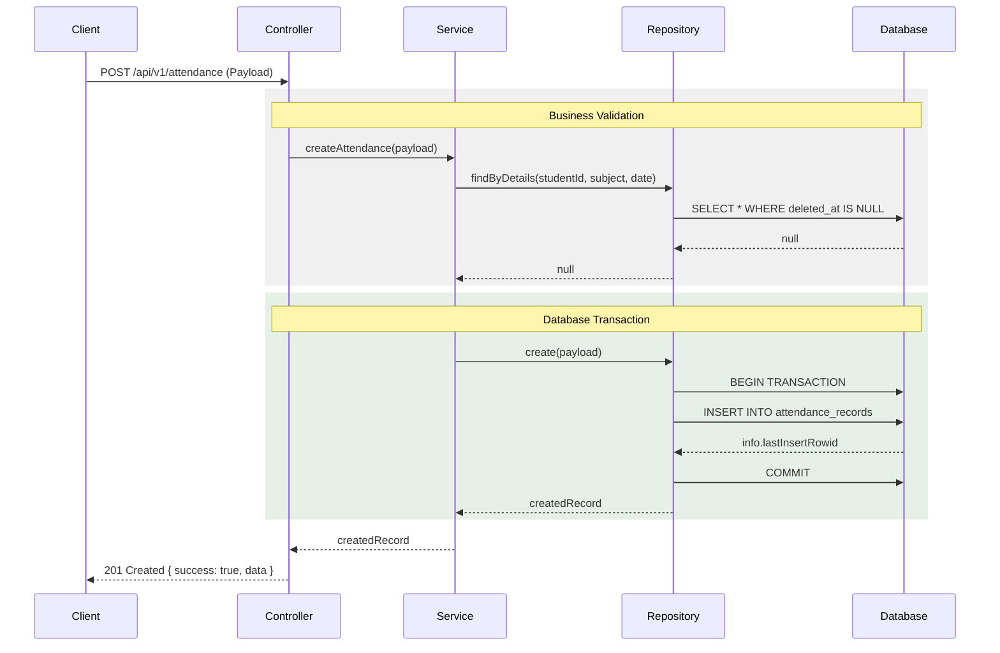

# Sequence Diagram

```mermaid
sequenceDiagram
    participant Client
    participant Controller
    participant Service
    participant Repository
    participant Database

    Client->>Controller: POST /api/v1/attendance (Payload)
    
    rect rgb(240, 240, 240)
        Note over Controller, Database: Business Validation
        Controller->>Service: createAttendance(payload)
        Service->>Repository: findByDetails(studentId, subject, date)
        Repository->>Database: SELECT * WHERE deleted_at IS NULL
        Database-->>Repository: null
        Repository-->>Service: null
    end

    rect rgb(230, 240, 230)
        Note over Controller, Database: Database Transaction
        Service->>Repository: create(payload)
        Repository->>Database: BEGIN TRANSACTION
        Repository->>Database: INSERT INTO attendance_records
        Database-->>Repository: info.lastInsertRowid
        Repository->>Database: COMMIT
        Repository-->>Service: createdRecord
    end
    
    Service-->>Controller: createdRecord
    Controller-->>Client: 201 Created { success: true, data }
```
